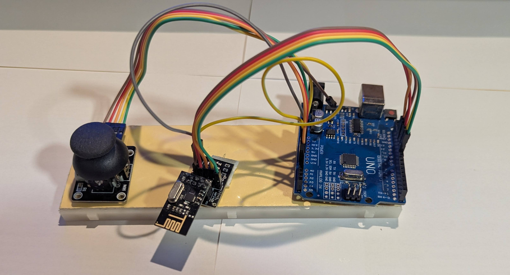
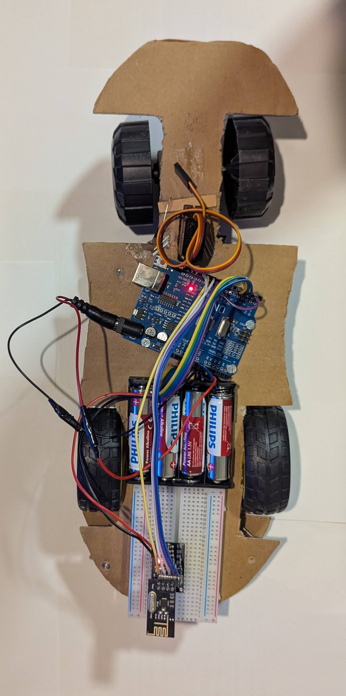
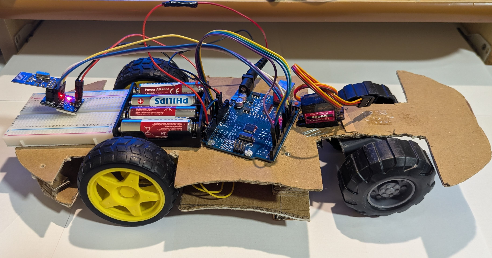
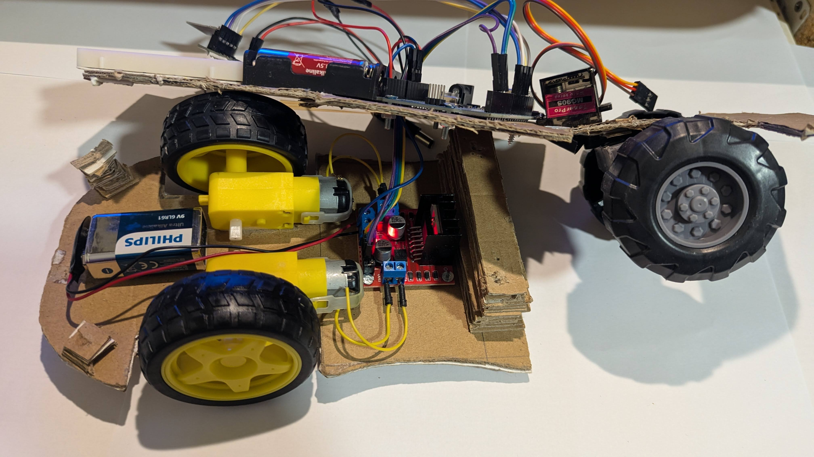

# Arduino Wireless Car (nRF24L01)

## Overview

This project presents a wireless-controlled Arduino car using nRF24L01 radio modules. The system consists of a transmitter unit (controller) and a receiver unit mounted on the car. Communication between the two is achieved using 2.4 GHz RF modules.

## Description

The transmitter reads analog input from a joystick and sends the data wirelessly using an nRF24L01 module. The receiver interprets the received values and controls two DC motors accordingly, enabling forward, backward, and stop movements.

The system demonstrates real-time wireless communication and basic motor control logic using Arduino.

## Features

* Wireless communication using nRF24L01
* Real-time control via joystick
* Bidirectional motor control (forward / backward / stop)
* Simple and efficient control logic
* Low power consumption configuration

## Hardware Components

* 2 × Arduino boards
* 2 × nRF24L01 modules
* Joystick module (analog)
* L298N motor driver
* 2 × DC motors
* Power supply (battery pack)

## Software Implementation

The project is divided into two main parts:

### Transmitter

* Reads joystick input (analog signal)
* Sends data via RF module
* Uses low data rate for improved range
  

### Receiver

* Receives wireless data
* Interprets joystick position
* Controls motors based on thresholds:

  * Forward movement
  * Backward movement

  

## How It Works

1. The joystick position is read as an analog value.
2. The value is transmitted wirelessly using the nRF24L01 module.
3. The receiver processes the data and determines the movement direction.
4. Motors are activated accordingly to drive the car.

## Files

* `Transmiter.ino` – code for the controller unit
* `Receiver.ino` – code for the car (receiver)

## Applications

* Remote-controlled vehicles
* Wireless embedded systems

## Author

Mihai Pelin

